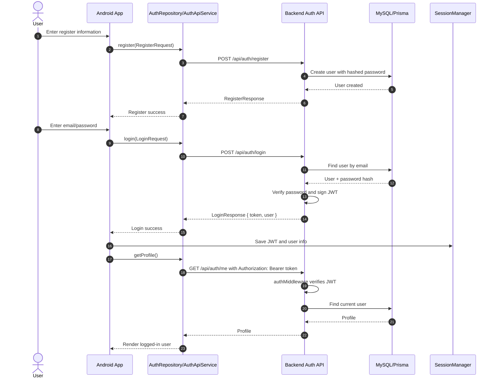
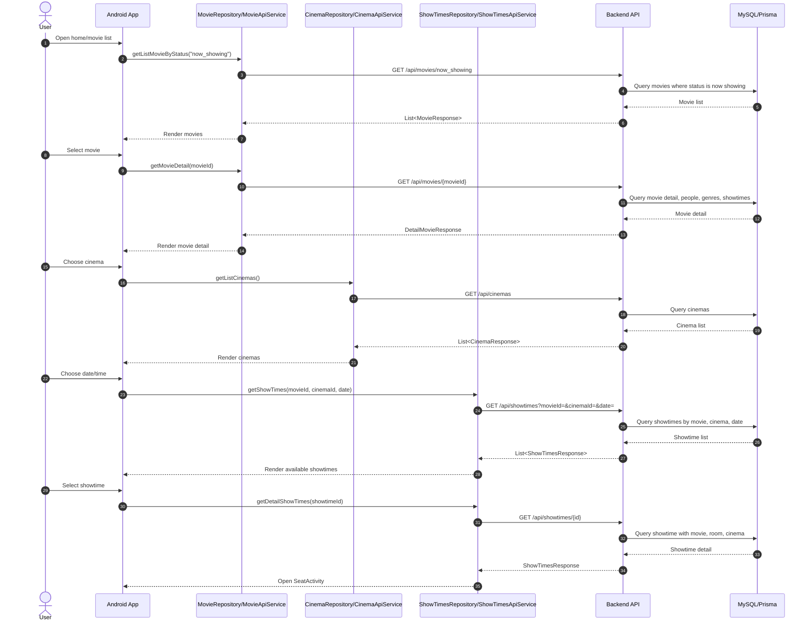
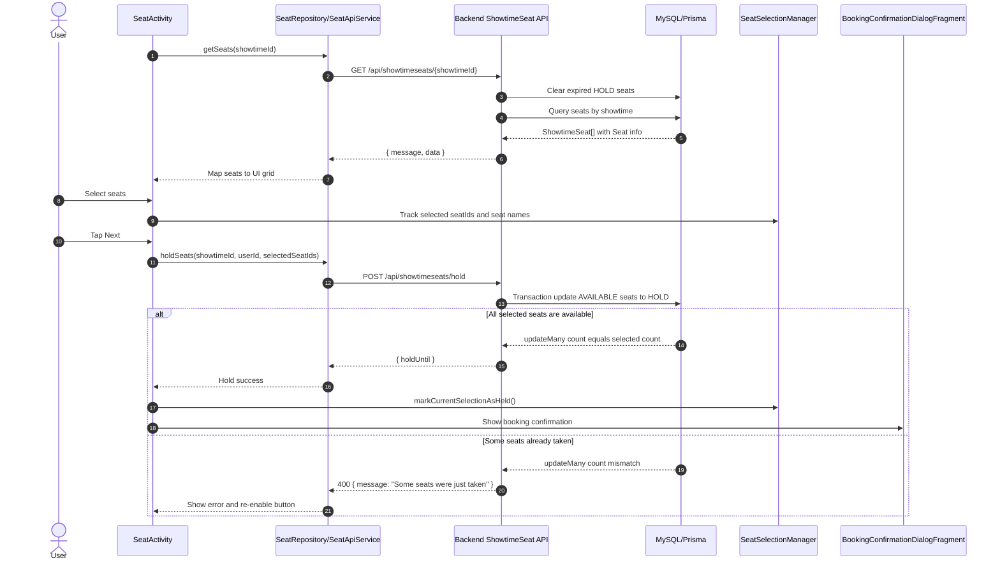
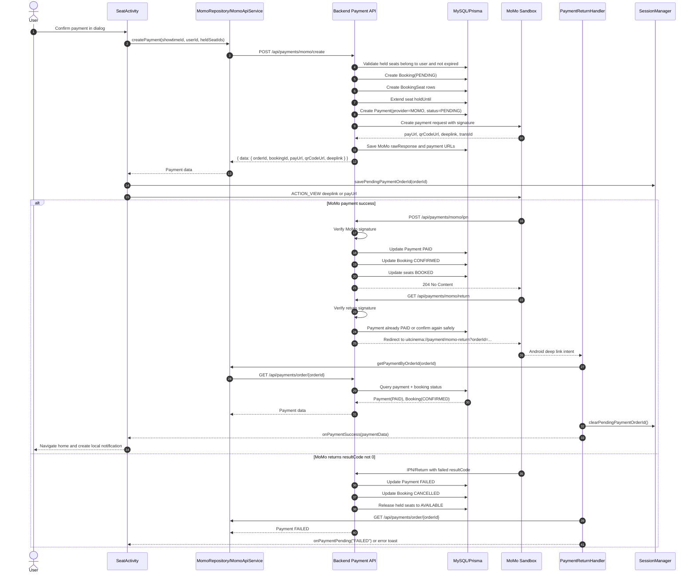
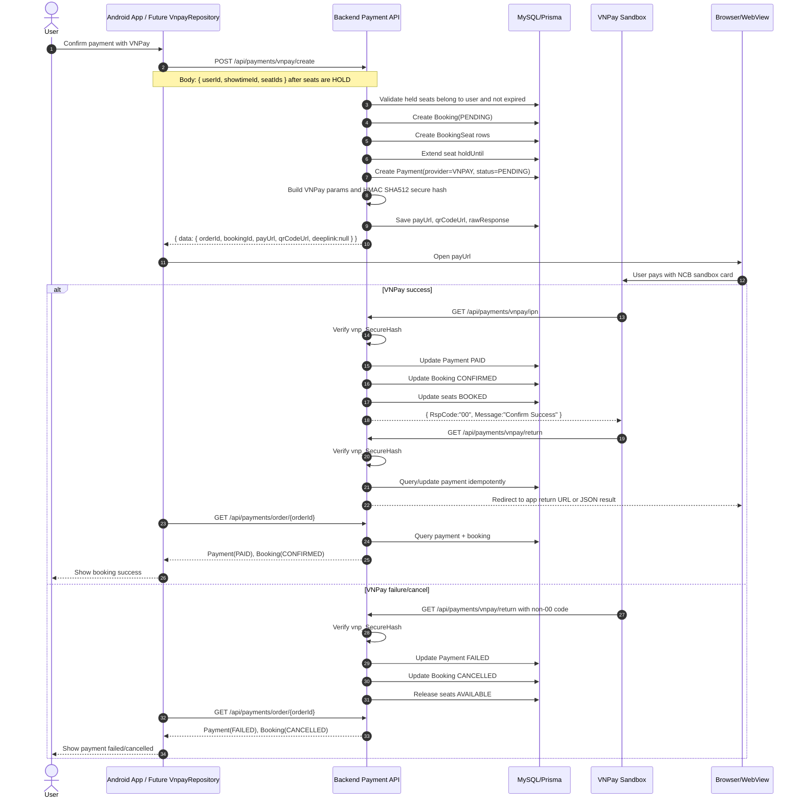
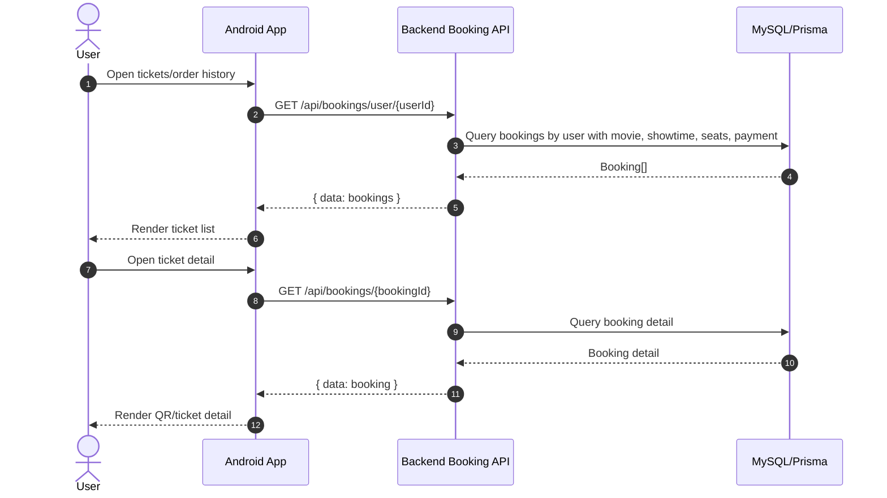
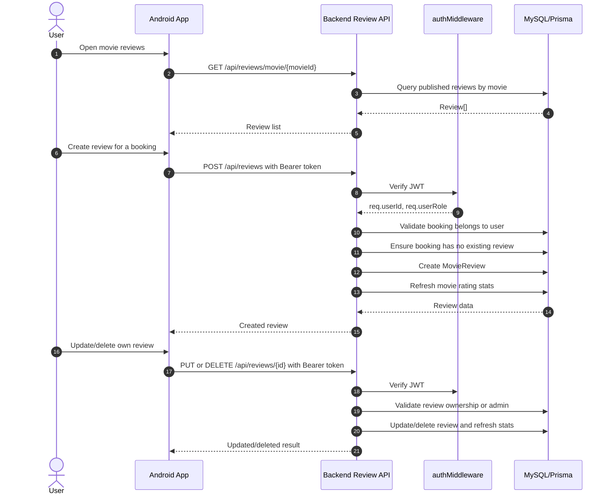
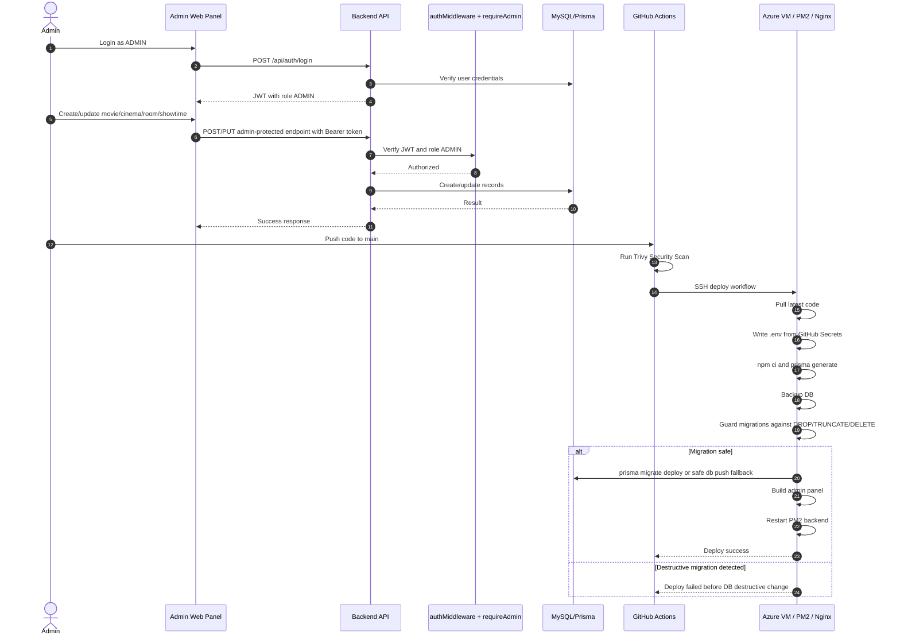

# Cinema System Sequence Diagrams

This document describes the sequence flows between:

```txt
Cinema Android app: https://github.com/nmkhoi3006/Cinema-Android
Backend API: this repository
Database: MySQL via Prisma
Payment gateways: MoMo sandbox and VNPay sandbox
```

Backend base URL:

```txt
http://uit-cinema.koreacentral.cloudapp.azure.com/api
```

Important implementation notes:

```txt
The current Android app uses Retrofit with base URL /api/.
The current Android payment flow is MoMo: POST /payments/momo/create.
VNPay is already supported by the backend: POST /payments/vnpay/create.
Android needs a small client-side switch/new repository method to use VNPay.
```

## 1. Register And Login

Used Android classes:

```txt
AuthApiService
SignupActivity
LoginActivity
SessionManager
```

Used backend routes:

```txt
POST /api/auth/register
POST /api/auth/login
GET /api/auth/me
```



## 2. Browse Movies, Cinemas, Dates, And Showtimes

Used Android classes:

```txt
MovieApiService
CinemaApiService
ShowTimesApiService
MovieDetailActivity
ChooseCinemaActivity
DateTimeActivity
SeatActivity
```

Used backend routes:

```txt
GET /api/movies/now_showing
GET /api/movies/coming_soon
GET /api/movies/:movieId
GET /api/cinemas
GET /api/showtimes?movieId=&cinemaId=&date=
GET /api/showtimes/:id
```



## 3. Seat Selection And Hold

Used Android classes:

```txt
SeatActivity
SeatRepository
SeatApiService
SeatSelectionManager
BookingConfirmationDialogFragment
```

Used backend routes:

```txt
GET /api/showtimeseats/:showtimeId
POST /api/showtimeseats/hold
POST /api/showtimeseats/release
```



## 4. Booking And MoMo Payment Flow (Current Android Flow)

Used Android classes:

```txt
SeatActivity
MomoRepository
MomoApiService
PaymentReturnHandler
SessionManager
```

Used backend routes:

```txt
POST /api/payments/momo/create
POST /api/payments/momo/ipn
GET /api/payments/momo/return
GET /api/payments/order/:orderId
```



## 5. Booking And VNPay Payment Flow (Backend Supported, Android Needs Client Hook)

Backend VNPay support was added for sandbox fallback.

Used backend routes:

```txt
POST /api/payments/vnpay/create
GET /api/payments/vnpay/return
GET /api/payments/vnpay/ipn
GET /api/payments/order/:orderId
```

Android change needed:

```txt
Add VnpayApiService.createPayment() similar to MomoApiService.
Open response.data.payUrl with ACTION_VIEW.
After return, call GET /payments/order/{orderId} like PaymentReturnHandler already does.
```



## 6. View Tickets / Booking History

Used backend routes:

```txt
GET /api/bookings/user/:userId
GET /api/bookings/:id
```



## 7. Reviews

Used backend routes:

```txt
GET /api/reviews/movie/:movieId
GET /api/reviews/me
GET /api/reviews/:id
POST /api/reviews
PUT /api/reviews/:id
DELETE /api/reviews/:id
PATCH /api/reviews/:id/status
```



## 8. Admin Web Panel And Production Deploy

Used backend/admin pieces:

```txt
Admin panel: /admin/
Admin APIs use JWT + requireAdmin middleware.
GitHub Actions: Deploy Backend workflow.
Prisma migration guard blocks destructive SQL.
Trivy Security Scan workflow runs on push/PR.
```



## Endpoint Map Used In These Diagrams

```txt
Auth:
POST /api/auth/register
POST /api/auth/login
GET  /api/auth/me

Movies/Cinemas/Showtimes:
GET /api/movies/now_showing
GET /api/movies/coming_soon
GET /api/movies/:movieId
GET /api/cinemas
GET /api/showtimes?movieId=&cinemaId=&date=
GET /api/showtimes/:id

Seats:
GET  /api/showtimeseats/:showtimeId
POST /api/showtimeseats/hold
POST /api/showtimeseats/release

Payments:
POST /api/payments/momo/create
POST /api/payments/momo/ipn
GET  /api/payments/momo/return
POST /api/payments/vnpay/create
GET  /api/payments/vnpay/return
GET  /api/payments/vnpay/ipn
GET  /api/payments/order/:orderId

Bookings:
GET /api/bookings/user/:userId
GET /api/bookings/:id
POST /api/bookings/:id/cancel

Reviews:
GET    /api/reviews/movie/:movieId
GET    /api/reviews/me
GET    /api/reviews/:id
POST   /api/reviews
PUT    /api/reviews/:id
DELETE /api/reviews/:id
PATCH  /api/reviews/:id/status
```
