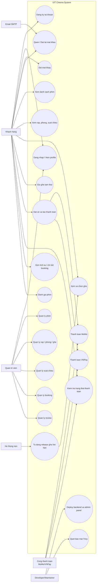
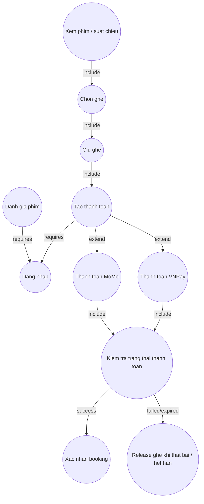
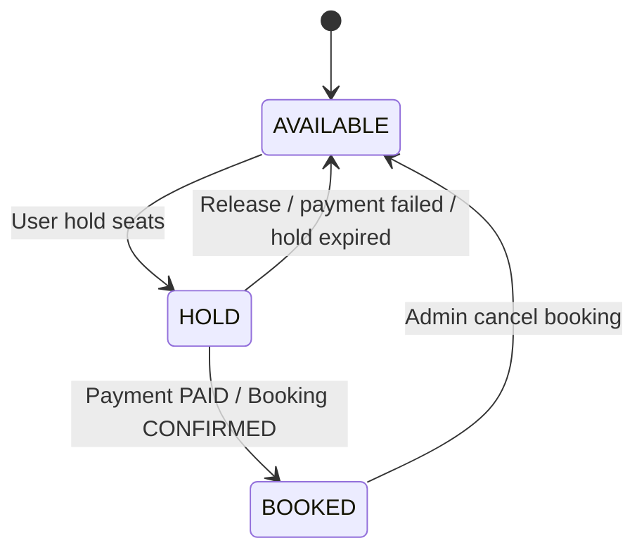
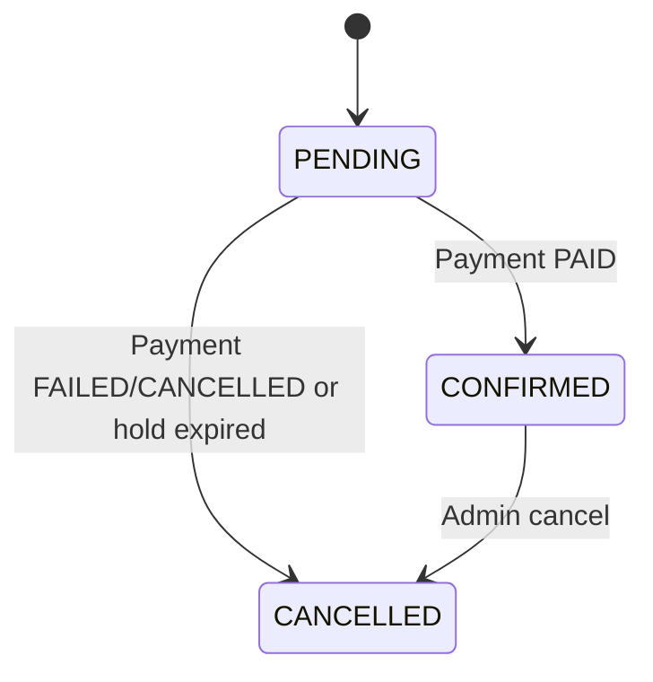
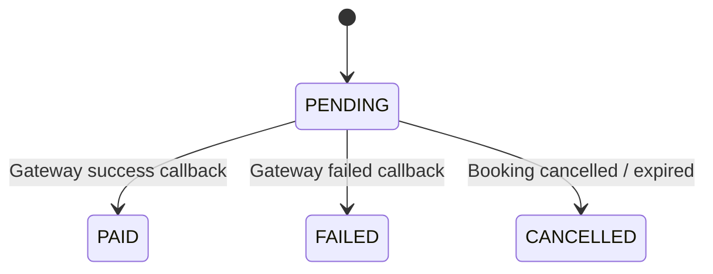

# Cinema Use Case Diagram And Specifications

Tai lieu nay mo ta use case cua he thong dat ve xem phim UIT Cinema, dua tren:

```txt
Backend API: repository hien tai
Mobile app: https://github.com/nmkhoi3006/Cinema-Android
Admin panel: src/admin-panel trong repository backend
Payment gateways: MoMo sandbox, VNPay sandbox
Database: MySQL qua Prisma
Production URL: http://uit-cinema.koreacentral.cloudapp.azure.com/api
```

## 1. Tong Quan Actor

| Actor | Vai tro |
| --- | --- |
| Khach hang | Nguoi dung ung dung Android de xem phim, chon ghe, dat ve, thanh toan, xem lich su, danh gia phim. |
| Quan tri vien | Nguoi dung admin panel de quan ly phim, rap, phong, ghe, suat chieu, booking va review. |
| Cong thanh toan | He thong ben ngoai xu ly thanh toan MoMo hoac VNPay sandbox. |
| Email SMTP | He thong gui email dung cho quen mat khau. |
| Developer/Maintainer | Nguoi push code len GitHub de kich hoat CI/CD, deploy va security scan. |
| He thong nen | Cron job va backend job tu dong release ghe het han hold. |

## 2. Use Case Diagram Tong Quan



## 3. Quan He Include / Extend



## 4. Dac Ta Use Case

### UC-01: Dang Ky Tai Khoan

| Muc | Noi dung |
| --- | --- |
| Actor chinh | Khach hang |
| Muc tieu | Tao tai khoan moi de su dung app. |
| Tien dieu kien | Email chua ton tai trong he thong. |
| Hau dieu kien thanh cong | User duoc tao voi role mac dinh `CUSTOMER`. |
| API lien quan | `POST /api/auth/register` |

Luồng chính:

1. Khach hang nhap ten, email, mat khau va thong tin ca nhan neu co.
2. Android app gui request dang ky len backend.
3. Backend kiem tra email da ton tai hay chua.
4. Backend hash mat khau va luu user vao MySQL.
5. Backend tra ve ket qua dang ky thanh cong.

Ngoại lệ:

1. Email da ton tai: backend tra ve loi, app hien thong bao.
2. Thieu thong tin bat buoc: backend tra ve loi validate.

### UC-02: Dang Nhap Va Xem Profile

| Muc | Noi dung |
| --- | --- |
| Actor chinh | Khach hang, Quan tri vien |
| Muc tieu | Lay JWT de goi cac API can xac thuc. |
| Tien dieu kien | Tai khoan da ton tai. |
| Hau dieu kien thanh cong | App luu token va thong tin user trong SessionManager. |
| API lien quan | `POST /api/auth/login`, `GET /api/auth/me` |

Luồng chính:

1. User nhap email va mat khau.
2. App gui request login.
3. Backend tim user theo email va kiem tra mat khau.
4. Backend tao JWT co thong tin user.
5. App luu JWT va goi `GET /api/auth/me` khi can lay profile.

Ngoại lệ:

1. Sai email hoac mat khau: backend tra ve loi dang nhap.
2. Token het han hoac sai: `authMiddleware` tu choi request.

### UC-03: Doi Mat Khau

| Muc | Noi dung |
| --- | --- |
| Actor chinh | Khach hang, Quan tri vien |
| Muc tieu | Doi mat khau khi con dang nhap. |
| Tien dieu kien | User da dang nhap va co JWT hop le. |
| Hau dieu kien thanh cong | Mat khau moi duoc hash va luu vao DB. |
| API lien quan | `POST /api/auth/changepassword` |

Luồng chính:

1. User nhap mat khau cu va mat khau moi.
2. App gui request kem JWT.
3. Backend kiem tra JWT, mat khau cu va hash mat khau moi.
4. Backend cap nhat password trong bang `User`.

Ngoại lệ:

1. Mat khau cu sai: backend tra ve loi.
2. Token khong hop le: backend tra ve loi xac thuc.

### UC-04: Quen Va Dat Lai Mat Khau

| Muc | Noi dung |
| --- | --- |
| Actor chinh | Khach hang, Email SMTP |
| Muc tieu | Gui ma reset qua email va dat lai mat khau. |
| Tien dieu kien | Email ton tai trong he thong. |
| Hau dieu kien thanh cong | Password moi duoc cap nhat, ma reset duoc danh dau da dung. |
| API lien quan | `POST /api/auth/forgotpassword`, `POST /api/auth/resetpassword` |

Luồng chính:

1. User nhap email quen mat khau.
2. Backend tao reset code, luu hash vao bang `PasswordReset`.
3. Backend gui email qua SMTP.
4. User nhap code va mat khau moi.
5. Backend kiem tra code, han su dung va cap nhat mat khau.

Ngoại lệ:

1. Email khong ton tai: backend tra ve loi hoac thong bao phu hop.
2. Code sai, het han hoac da dung: backend tu choi reset.

### UC-05: Xem Danh Sach Va Chi Tiet Phim

| Muc | Noi dung |
| --- | --- |
| Actor chinh | Khach hang |
| Muc tieu | Xem phim dang chieu, sap chieu va chi tiet phim. |
| Tien dieu kien | Backend co du lieu phim. |
| Hau dieu kien thanh cong | App hien danh sach hoac chi tiet phim. |
| API lien quan | `GET /api/movies`, `GET /api/movies/now_showing`, `GET /api/movies/coming_soon`, `GET /api/movies/:id` |

Luồng chính:

1. App goi API lay danh sach phim.
2. Backend doc bang `Movie` kem genre, people va showtime neu can.
3. App hien poster, title, status, duration, rating va thong tin chi tiet.

Ngoại lệ:

1. Khong co phim: app hien danh sach rong.
2. Movie id khong ton tai: backend tra ve loi not found.

### UC-06: Xem Rap, Phong Va Suat Chieu

| Muc | Noi dung |
| --- | --- |
| Actor chinh | Khach hang |
| Muc tieu | Chon rap, ngay va suat chieu de dat ve. |
| Tien dieu kien | Da co cinema, room, movie va showtime. |
| Hau dieu kien thanh cong | App hien cac suat chieu phu hop. |
| API lien quan | `GET /api/cinemas`, `GET /api/rooms`, `GET /api/showtimes?movieId=&cinemaId=&date=` |

Luồng chính:

1. User chon phim hoac rap.
2. App goi API lay cinema va showtime theo filter.
3. Backend truy van `Showtime`, `Room`, `Cinema`, `Movie`.
4. App hien gio chieu va gia ve.

Ngoại lệ:

1. Khong co suat chieu theo ngay da chon: app hien thong bao het suat.
2. Showtime khong ton tai: backend tra ve not found.

### UC-07: Xem Va Chon Ghe

| Muc | Noi dung |
| --- | --- |
| Actor chinh | Khach hang |
| Muc tieu | Xem so do ghe cua mot suat chieu va chon ghe con trong. |
| Tien dieu kien | Showtime da ton tai va co `ShowtimeSeat`. |
| Hau dieu kien thanh cong | User co danh sach ghe muon giu/thanh toan. |
| API lien quan | `GET /api/showtimeseats/:showtimeId` |

Luồng chính:

1. User vao man hinh chon ghe.
2. App goi API lay ghe theo showtime.
3. Backend tra ve danh sach ghe voi status `AVAILABLE`, `HOLD`, `BOOKED`.
4. App chi cho chon ghe `AVAILABLE`.

Ngoại lệ:

1. Ghe dang `HOLD` boi user khac: app khong cho chon.
2. Ghe da `BOOKED`: app khong cho chon.

### UC-08: Giu Ghe Tam Thoi

| Muc | Noi dung |
| --- | --- |
| Actor chinh | Khach hang |
| Muc tieu | Khoa tam ghe trong luc user thanh toan. |
| Tien dieu kien | Ghe dang `AVAILABLE`. |
| Hau dieu kien thanh cong | Ghe chuyen sang `HOLD`, co `holdUntil` va `heldBy`. |
| API lien quan | `POST /api/showtimeseats/hold`, `POST /api/showtimeseats/release` |

Luồng chính:

1. App gui `userId`, `showtimeId`, `seatIds` de giu ghe.
2. Backend kiem tra ghe co hop le va con trong khong.
3. Backend cap nhat `ShowtimeSeat.status = HOLD`.
4. Backend tra ve danh sach ghe da giu thanh cong.

Ngoại lệ:

1. Ghe da bi giu/dat: backend tra ve loi.
2. User huy chon ghe: app goi release de tra ghe ve `AVAILABLE`.
3. Qua thoi gian giu ghe: cron job tu dong release ghe.

### UC-09: Dat Ve Va Tao Thanh Toan

| Muc | Noi dung |
| --- | --- |
| Actor chinh | Khach hang |
| Actor phu | Cong thanh toan |
| Muc tieu | Tao booking pending va link thanh toan. |
| Tien dieu kien | User da chon ghe va ghe dang duoc hold hop le. |
| Hau dieu kien thanh cong | Tao `Booking PENDING`, `Payment PENDING`, tra ve `payUrl`, `orderId`. |
| API lien quan | `POST /api/payments/momo/create`, `POST /api/payments/vnpay/create` |

Luồng chính:

1. App gui `userId`, `showtimeId`, `seatIds` va chon provider thanh toan.
2. Backend tinh tong tien tu gia showtime va so ghe.
3. Backend tao booking tam thoi va payment pending.
4. Backend goi MoMo hoac tao URL VNPay.
5. Backend tra ve `orderId`, `payUrl`, `qrCodeUrl` neu co.
6. App mo `payUrl` bang browser/webview.

Ngoại lệ:

1. Ghe khong con hop le: backend tu choi tao payment.
2. Cong thanh toan loi: backend tra ve loi va co the release ghe/booking tuy logic provider.

### UC-10: Thanh Toan MoMo

| Muc | Noi dung |
| --- | --- |
| Actor chinh | Cong thanh toan MoMo |
| Actor phu | Khach hang |
| Muc tieu | Nhan ket qua thanh toan MoMo va cap nhat booking. |
| Tien dieu kien | Da tao payment provider `MOMO`. |
| Hau dieu kien thanh cong | Payment `PAID`, Booking `CONFIRMED`, ghe `BOOKED`. |
| API lien quan | `POST /api/payments/momo/ipn`, `GET /api/payments/momo/return`, `GET /api/payments/order/:orderId` |

Luồng chính:

1. User thanh toan tren MoMo sandbox.
2. MoMo goi IPN ve backend.
3. Backend verify signature va `resultCode`.
4. Neu thanh cong, backend cap nhat payment, booking va ghe.
5. App goi API theo `orderId` de lay trang thai moi nhat.

Ngoại lệ:

1. Signature sai: backend tu choi IPN.
2. Thanh toan fail: payment `FAILED`, booking `CANCELLED`, ghe duoc release.
3. MoMo chua callback kip: app polling `GET /api/payments/order/:orderId`.

### UC-11: Thanh Toan VNPay

| Muc | Noi dung |
| --- | --- |
| Actor chinh | Cong thanh toan VNPay |
| Actor phu | Khach hang |
| Muc tieu | Thanh toan qua VNPay sandbox va cap nhat booking. |
| Tien dieu kien | Da tao payment provider `VNPAY`. |
| Hau dieu kien thanh cong | Payment `PAID`, Booking `CONFIRMED`, ghe `BOOKED`. |
| API lien quan | `POST /api/payments/vnpay/create`, `GET /api/payments/vnpay/return`, `GET /api/payments/vnpay/ipn`, `GET /api/payments/order/:orderId` |

Luồng chính:

1. App goi API tao VNPay payment.
2. Backend tao URL co `vnp_TmnCode`, `vnp_Amount`, `vnp_TxnRef`, `vnp_ReturnUrl` va checksum.
3. User mo `payUrl` va thanh toan bang the test NCB tren sandbox.
4. VNPay redirect ve return URL va/hoac goi IPN.
5. Backend verify `vnp_SecureHash`.
6. Neu `vnp_ResponseCode = 00` va `vnp_TransactionStatus = 00`, backend xac nhan booking.

Ngoại lệ:

1. Checksum sai: backend tra ve loi.
2. So tien khong khop: IPN tra ve ma loi `04`.
3. Giao dich fail/huy: payment failed, booking cancelled, ghe release.

### UC-12: Kiem Tra Trang Thai Thanh Toan

| Muc | Noi dung |
| --- | --- |
| Actor chinh | Khach hang |
| Muc tieu | App biet giao dich da thanh cong hay chua sau khi quay ve tu gateway. |
| Tien dieu kien | Da co `orderId`. |
| Hau dieu kien thanh cong | App hien ve thanh cong hoac that bai. |
| API lien quan | `GET /api/payments/order/:orderId` |

Luồng chính:

1. App lay `orderId` tu response tao payment hoac pending session.
2. App goi API kiem tra payment.
3. Backend tra ve payment, booking va status hien tai.
4. App dieu huong sang man hinh thanh cong neu `PAID` hoac `CONFIRMED`.

Ngoại lệ:

1. Payment con `PENDING`: app tiep tuc polling trong mot khoang thoi gian.
2. Payment `FAILED` hoac `CANCELLED`: app hien loi va cho chon ghe lai.

### UC-13: Xem Lich Su Va Chi Tiet Booking

| Muc | Noi dung |
| --- | --- |
| Actor chinh | Khach hang |
| Muc tieu | Xem cac ve da dat va chi tiet tung booking. |
| Tien dieu kien | User da co booking. |
| Hau dieu kien thanh cong | App hien lich su ve. |
| API lien quan | `GET /api/bookings/user/:userId`, `GET /api/bookings/:id` |

Luồng chính:

1. User vao man hinh lich su ve.
2. App goi API lay booking theo user.
3. Backend tra ve booking kem movie, showtime, ghe va payment.
4. User chon mot booking de xem chi tiet.

Ngoại lệ:

1. User chua co booking: app hien danh sach rong.
2. Booking id khong ton tai: backend tra ve not found.

### UC-14: Danh Gia Phim

| Muc | Noi dung |
| --- | --- |
| Actor chinh | Khach hang |
| Muc tieu | Danh gia phim sau khi da dat ve. |
| Tien dieu kien | User da dang nhap va co booking hop le cho phim. |
| Hau dieu kien thanh cong | Review duoc tao/cap nhat, rating phim duoc tinh lai. |
| API lien quan | `GET /api/reviews/movie/:movieId`, `GET /api/reviews/me`, `POST /api/reviews`, `PUT /api/reviews/:id`, `DELETE /api/reviews/:id` |

Luồng chính:

1. User vao phim hoac booking da xem.
2. App hien danh sach review va form danh gia.
3. User gui rating, content va co the danh dau spoiler.
4. Backend kiem tra booking hop le va tao review.
5. Backend cap nhat rating trung binh cua movie.

Ngoại lệ:

1. User chua co booking hop le: backend tu choi tao review.
2. User da review booking nay: backend tu choi tao review trung lap.
3. Review bi admin an: user khac khong thay review do.

### UC-15: Quan Ly Phim

| Muc | Noi dung |
| --- | --- |
| Actor chinh | Quan tri vien |
| Muc tieu | Them, sua, xoa phim va thong tin phim. |
| Tien dieu kien | Admin da dang nhap va co role `ADMIN`. |
| Hau dieu kien thanh cong | Bang `Movie` va cac bang lien quan duoc cap nhat. |
| API lien quan | `POST /api/movies`, `PUT /api/movies/:id`, `DELETE /api/movies/:id` |

Luồng chính:

1. Admin dang nhap vao admin panel.
2. Admin tao hoac sua thong tin phim.
3. Backend qua `authMiddleware` va `requireAdmin`.
4. Backend cap nhat movie, genre, cast/director neu request co du lieu.

Ngoại lệ:

1. Token khong hop le: backend tu choi.
2. User khong phai admin: backend tra ve forbidden.
3. Xoa phim co rang buoc du lieu: backend co the tra ve loi DB/rang buoc.

### UC-16: Quan Ly Rap, Phong Va Ghe

| Muc | Noi dung |
| --- | --- |
| Actor chinh | Quan tri vien |
| Muc tieu | Quan ly co so rap, phong chieu va ghe. |
| Tien dieu kien | Admin da dang nhap. |
| Hau dieu kien thanh cong | Du lieu `Cinema`, `Room`, `Seat` duoc cap nhat. |
| API lien quan | `/api/cinemas`, `/api/rooms`, `/api/seats`, `GET /api/seats/room/:roomId` |

Luồng chính:

1. Admin tao cinema.
2. Admin tao room thuoc cinema.
3. Admin tao seat theo room bang rows/columns.
4. Backend luu du lieu va app/admin panel co the doc lai.

Ngoại lệ:

1. Room khong ton tai khi tao ghe: backend tra ve loi.
2. Xoa seat/room dang co showtime hoac booking: co nguy co loi rang buoc du lieu.

Ghi chu van hanh:

1. Voi production DB da co du lieu, tranh drop/xoa bang tuy tien.
2. Neu can thay doi schema, uu tien them bang/cot moi hoac sua logic an toan.

### UC-17: Quan Ly Suat Chieu

| Muc | Noi dung |
| --- | --- |
| Actor chinh | Quan tri vien |
| Muc tieu | Tao va cap nhat lich chieu cho phim. |
| Tien dieu kien | Da co movie va room. |
| Hau dieu kien thanh cong | `Showtime` va `ShowtimeSeat` duoc tao/cap nhat. |
| API lien quan | `POST /api/showtimes`, `PUT /api/showtimes/:id`, `DELETE /api/showtimes/:id` |

Luồng chính:

1. Admin chon movie, room, startTime, endTime va price.
2. Backend tao showtime.
3. Backend tao danh sach `ShowtimeSeat` tu seat cua room.
4. Khach hang co the thay suat chieu moi tren app.

Ngoại lệ:

1. Movie/room khong ton tai: backend tra ve loi.
2. Thoi gian chieu khong hop le: backend tra ve loi validate neu co logic kiem tra.
3. Xoa showtime da co booking: co nguy co loi rang buoc hoac mat du lieu nghiep vu.

### UC-18: Quan Ly Booking

| Muc | Noi dung |
| --- | --- |
| Actor chinh | Quan tri vien |
| Muc tieu | Xem, tao booking thu cong da thanh toan, huy booking. |
| Tien dieu kien | Admin da dang nhap. |
| Hau dieu kien thanh cong | Booking/payment/seat duoc cap nhat dung trang thai. |
| API lien quan | `GET /api/bookings`, `POST /api/bookings/manual-paid`, `POST /api/bookings/:id/cancel` |

Luồng chính:

1. Admin xem danh sach booking tren admin panel.
2. Backend tra ve booking theo status/search neu co.
3. Admin co the tao booking manual paid cho truong hop can xu ly thu cong.
4. Admin co the huy booking, backend release/cap nhat ghe theo logic service.

Ngoại lệ:

1. Booking khong ton tai: backend tra ve not found.
2. Booking da o trang thai cuoi: backend co the tu choi hoac khong thay doi.

### UC-19: Quan Ly Review

| Muc | Noi dung |
| --- | --- |
| Actor chinh | Quan tri vien |
| Muc tieu | An/hien review cua khach hang. |
| Tien dieu kien | Admin da dang nhap. |
| Hau dieu kien thanh cong | `MovieReview.status` duoc doi thanh `PUBLISHED` hoac `HIDDEN`. |
| API lien quan | `PATCH /api/reviews/:id/status` |

Luồng chính:

1. Admin xem danh sach review.
2. Admin chon review can an/hien.
3. Backend kiem tra role admin.
4. Backend cap nhat status review.

Ngoại lệ:

1. Review khong ton tai: backend tra ve not found.
2. User khong phai admin: backend tra ve forbidden.

### UC-20: Deploy Backend Va Admin Panel

| Muc | Noi dung |
| --- | --- |
| Actor chinh | Developer/Maintainer |
| Muc tieu | Push code len GitHub va tu dong deploy len server production. |
| Tien dieu kien | GitHub Actions secrets da cau hinh dung, server SSH duoc. |
| Hau dieu kien thanh cong | PM2 restart backend, nginx phuc vu backend/admin panel moi. |
| Thanh phan lien quan | GitHub Actions, Azure VM, PM2, nginx, `.env` tu GitHub Secrets |

Luồng chính:

1. Developer push commit len branch `main`.
2. GitHub Actions chay workflow deploy.
3. Workflow SSH vao server va pull code moi.
4. Workflow cai dependency, generate Prisma client neu can, build admin panel neu co.
5. Workflow restart PM2 app `backend`.
6. Backend health check tra ve thanh cong.

Ngoại lệ:

1. Secret thieu/sai: deploy fail hoac server `.env` bi sai gia tri.
2. Migration co lenh nguy hiem: co nguy co anh huong production DB.
3. PM2 restart fail: backend khong online, can doc log PM2.

Quy tac DB production:

1. Khong drop bang/cot tren DB production neu chua backup va chua co ke hoach rollback.
2. Chi chap nhan thay doi an toan nhu them cot, them bang, them index, hoac sua logic khong pha du lieu cu.
3. Neu khong dung bang cu nua, uu tien tao bang moi va bo xo bang cu thay vi drop.

### UC-21: Quet Bao Mat Trivy

| Muc | Noi dung |
| --- | --- |
| Actor chinh | Developer/Maintainer |
| Muc tieu | Quet vulnerability, secret va misconfiguration tren code. |
| Tien dieu kien | Workflow security scan da co trong `.github/workflows/security-scan.yml`. |
| Hau dieu kien thanh cong | GitHub Actions co report Trivy. |
| Thanh phan lien quan | Trivy GitHub Action |

Luồng chính:

1. Developer push code len GitHub.
2. GitHub Actions chay Trivy scan.
3. Trivy quet filesystem cua repository.
4. Trivy hien HIGH/CRITICAL finding trong log action.

Ngoại lệ:

1. Trivy action loi version/network: workflow fail.
2. Finding la false positive: team danh gia va ignore co chu dich.

Ghi chu hien tai:

1. Workflow dang de `exit-code: 0`, tuc la report-only, khong chan deploy.
2. Neu muon bat chat hon, co the doi thanh `exit-code: 1` sau khi team da xu ly finding cu.

### UC-22: Tu Dong Release Ghe Het Han

| Muc | Noi dung |
| --- | --- |
| Actor chinh | He thong nen |
| Muc tieu | Tra ghe `HOLD` ve `AVAILABLE` khi user khong thanh toan kip. |
| Tien dieu kien | Co ghe dang `HOLD` va `holdUntil` da qua. |
| Hau dieu kien thanh cong | Ghe het han duoc release, user khac co the dat. |
| Thanh phan lien quan | `cron/clearExpiredSeats`, bang `ShowtimeSeat` |

Luồng chính:

1. Cron job chay dinh ky trong backend process.
2. Job tim cac `ShowtimeSeat` dang `HOLD` va qua `holdUntil`.
3. Job cap nhat status ve `AVAILABLE`, xoa `holdUntil` va `heldBy`.
4. Lan sau app goi so do ghe se thay ghe trong lai.

Ngoại lệ:

1. Backend process dung: cron khong chay, ghe co the bi hold lau hon du kien.
2. DB loi: job ghi log loi, can kiem tra PM2 logs.

## 5. Bang Tom Tat API Theo Use Case

| Nhom | API chinh |
| --- | --- |
| Auth | `POST /api/auth/register`, `POST /api/auth/login`, `GET /api/auth/me`, `POST /api/auth/changepassword`, `POST /api/auth/forgotpassword`, `POST /api/auth/resetpassword` |
| Movie | `GET /api/movies`, `GET /api/movies/now_showing`, `GET /api/movies/coming_soon`, `GET /api/movies/:id`, admin CRUD `/api/movies` |
| Cinema/Room/Seat | `/api/cinemas`, `/api/rooms`, `/api/seats`, `GET /api/seats/room/:roomId` |
| Showtime | `GET /api/showtimes`, `GET /api/showtimes/:id`, admin CRUD `/api/showtimes` |
| ShowtimeSeat | `GET /api/showtimeseats/:showtimeId`, `POST /api/showtimeseats/hold`, `POST /api/showtimeseats/release` |
| Booking | `GET /api/bookings/user/:userId`, `GET /api/bookings/:id`, admin `/api/bookings` |
| Payment | `POST /api/payments/momo/create`, `POST /api/payments/vnpay/create`, `GET /api/payments/order/:orderId` |
| Payment Callback | `POST /api/payments/momo/ipn`, `GET /api/payments/momo/return`, `GET /api/payments/vnpay/ipn`, `GET /api/payments/vnpay/return` |
| Review | `GET /api/reviews/movie/:movieId`, `GET /api/reviews/me`, `POST /api/reviews`, `PUT /api/reviews/:id`, `DELETE /api/reviews/:id`, admin `PATCH /api/reviews/:id/status` |

## 6. Trang Thai Nghiep Vu Chinh






